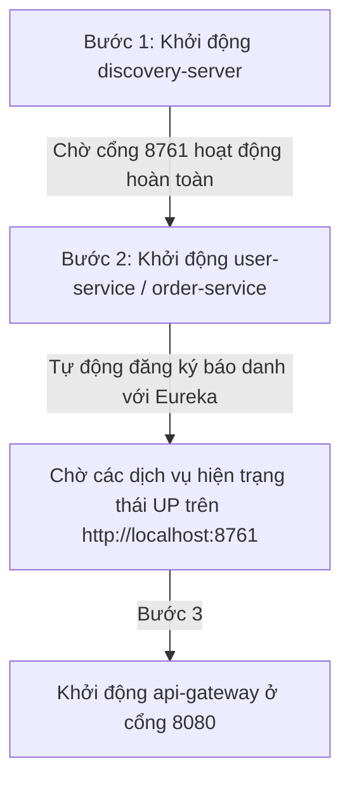

# Bài 2: Tạo OrderService và Thấu hiểu Cơ chế API Gateway

> [!NOTE]
> Tài liệu này đúc kết toàn bộ kiến thức thực chiến cốt lõi của **Bài học số 2** trong hành trình phát triển hệ thống Microservices sử dụng Spring Boot, Spring Cloud, Eureka và API Gateway.

---

## 📌 Phần 1: Thiết kế JPA Entity Tối giản & An toàn (Lombok Best Practice)

Trong bài học này, chúng ta đã tiến hành khởi tạo dịch vụ **`order-service`** với cơ sở dữ liệu H2 Database. Điểm nhấn kiến trúc cốt lõi nằm ở cách cấu hình đối tượng JPA Entity trong Java:

### 1. Mã nguồn Thực thể `Order.java` chuẩn mực
```java
package com.example.order_service.model;

import jakarta.persistence.Entity;
import jakarta.persistence.GeneratedValue;
import jakarta.persistence.GenerationType;
import jakarta.persistence.Id;
import jakarta.persistence.Table;
import lombok.AllArgsConstructor;
import lombok.Builder;
import lombok.Getter;
import lombok.NoArgsConstructor;
import lombok.Setter;

@Entity
@Table(name = "orders")
@Getter
@Setter
@NoArgsConstructor
@AllArgsConstructor
@Builder
public class Order {

    @Id
    @GeneratedValue(strategy = GenerationType.IDENTITY)
    private Long id;

    private Long userId;
    private String product;
    private Double price;
}
```
## 📌 Phần 2: Giải mã Định tuyến API Gateway: Cứng (Port) vs. Động (Load Balancer)

Khi cấu hình định tuyến (routing) trong file `application.yaml` của API Gateway, chúng ta có hai cách tiếp cận:

### 1. Phân tích so sánh chi tiết

```yaml
# Cách 1:
- id: order-service
  uri: http://localhost:8082
  predicates:
    - Path=/api/orders/**

# Cách 2:
- id: order-service
  uri: lb://order-service
  predicates:
    - Path=/api/orders/**
```

### 2. Bảng so sánh tính năng thực tế

| Tiêu chí | Cấu hình cứng cổng vật lý (`http://localhost:8082`) | Định tuyến động Load Balancer (`lb://order-service`) |
| :--- | :--- | :--- |
| **Bản chất** | Gọi trực tiếp đến duy nhất một địa chỉ IP và cổng vật lý cố định. | Nhờ sự hỗ trợ của **Eureka Discovery Server**, tự động tìm kiếm các tiến trình thực tế đang hoạt động và phân phối tải. |
| **Khả năng mở rộng (Scale Out)** | **Không thể.** Chỉ gánh được 1 instance duy nhất. Nếu chạy thêm instance ở cổng `8083`, Gateway hoàn toàn bỏ qua. | **Cực tốt.** Bạn có thể chạy 5, 10 hoặc hàng trăm instances cùng lúc. Gateway sẽ tự động chia đều tải (Load Balancing) cho các cổng đang mở. |
| **Tính sẵn sàng cao (High Availability)** | Nếu cổng `8082` bị sập, toàn bộ dịch vụ sập hoàn toàn (trả về lỗi `500 Internal Server Error`). | Nếu một instance bị sập, hệ thống tự động loại bỏ nó ra khỏi danh sách và điều hướng khách sang các instance còn sống mà không làm gián đoạn trải nghiệm người dùng. |
| **Rủi ro vận hành** | Rất cao khi dịch chuyển server hoặc triển khai trên môi trường Docker / Kubernetes. | Gần như bằng 0. Không cần quan tâm dịch vụ chạy ở đâu và cổng nào, chỉ cần trùng tên ứng dụng là hệ thống tự nhận diện. |

---

## 📌 Phần 3: Thấu hiểu khái niệm "Instance" (Thực thể hoạt động)

Một hiểu nhầm rất phổ biến của lập trình viên mới bắt đầu là: *"Chúng ta chỉ viết duy nhất một Project, lấy đâu ra nhiều Instance chạy song song?"*

### 1. Ẩn dụ thực tế: Bản vẽ thiết kế vs. Ngôi nhà thực tế
* **Project (Mã nguồn):** Chính là thư mục code `order-service` trên đĩa cứng của bạn. Nó đóng vai trò như một **Bản thiết kế kỹ thuật** để xây nhà. Chỉ có **1 bản duy nhất**.
* **Instance (Thực thể chạy):** Khi bạn nhấn nút "Run" trên IDE hoặc khởi chạy file `.jar` thông qua Terminal, máy tính sẽ nạp mã nguồn vào RAM và tạo ra một tiến trình thực tế. Đây chính là **Ngôi nhà thực tế** được xây dựng từ bản thiết kế.

> 💡 **Kết luận:** Từ **1 bản vẽ duy nhất** (1 Project), bạn hoàn toàn có thể xây dựng **nhiều ngôi nhà** (nhiều Instance) chạy đồng thời trên các cổng hoặc các máy chủ khác nhau để cùng chia sẻ tải dữ liệu!

---

## 📌 Phần 4: Quy trình Khởi động Hệ thống (Boot Sequence) & Xử lý lỗi 503

Trong môi trường Microservices, các thành phần phụ thuộc lẫn nhau một cách chặt chẽ. Khi bạn gọi API qua Gateway mà gặp lỗi:
`No servers available for service: user-service (503 Service Unavailable)`
Nghĩa là API Gateway đang bị **"mù thông tin"** và không biết dịch vụ đó đang nằm ở đâu.

### 1. Thứ tự khởi động (Boot Sequence) bắt buộc của hệ thống:



### 2. Các bước khắc phục khi gặp lỗi 503:
1. **Kiểm tra Eureka Server:** Truy cập `http://localhost:8761` trên trình duyệt. Kiểm tra xem tên của dịch vụ (`USER-SERVICE` hoặc `ORDER-SERVICE`) có hiển thị trong bảng danh sách đăng ký hay chưa.
2. **Kiểm tra độ trễ đồng bộ:** Eureka có độ trễ đồng bộ (Heartbeat delay) khoảng **30 giây**. Sau khi khởi động, hãy đợi 30 giây để dữ liệu được đồng bộ đầy đủ từ Eureka sang API Gateway trước khi gửi yêu cầu.
3. **Kiểm tra kết nối mạng nội bộ:** Đảm bảo cấu hình `defaultZone` trỏ chính xác về địa chỉ server của Eureka Server:
   ```yaml
   eureka:
     client:
       service-url:
         defaultZone: http://localhost:8761/eureka/
   ```
