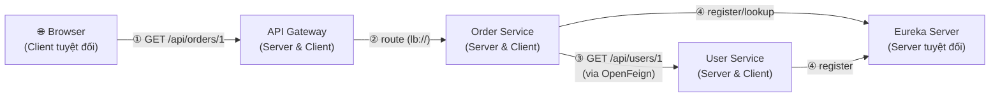

# Bài 3: Thấu hiểu Bản chất Client và Server trong Kiến trúc Microservices

> [!NOTE]
> Tài liệu này đúc kết toàn bộ kiến thức nền tảng thực chiến về **bản chất động của Client và Server** trong kiến trúc hệ thống phân tán, giúp tháo gỡ hoàn toàn hiểu lầm phổ biến khi bước từ lập trình Monolith/Web truyền thống sang thế giới Microservices.

---

## 📌 Phần 1: Xóa bỏ Tư duy Lối mòn (Frontend vs. Backend)

Một hiểu lầm rất phổ biến của nhiều lập trình viên khi mới làm quen với Web Development là:
* **Frontend (Trình duyệt, Mobile App)** mặc định luôn luôn là **Client**.
* **Backend (Spring Boot, Node.js, Python)** mặc định luôn luôn là **Server**.

> [!WARNING]
> Tư duy này **chỉ đúng trong phạm vi hẹp** của mô hình Web truyền thống (khi chỉ có 1 ứng dụng khách gọi trực tiếp tới 1 ứng dụng máy chủ). Trong kiến trúc Microservices phân tán, vai trò này thay đổi **linh hoạt và động** theo từng luồng tương tác cụ thể.

---

## 📌 Phần 2: Phân tích 3 Cấp độ Tương tác

### 1. Cấp độ Hệ thống Web truyền thống
Trong kiến trúc web cơ bản, vai trò được giữ cố định theo thiết kế vật lý:

```
[Browser / Mobile App]  ──── GET /api/users ────►  [Backend Spring Boot]
      CLIENT                                            SERVER
  (Chủ động gọi)                                  (Lắng nghe, xử lý)
                       ◄─── 200 OK + JSON ────
```

### 2. Cấp độ Microservices (Vai trò Thay đổi Động)
Khi bước vào thế giới hệ thống phân tán, một Backend Service **vừa có thể đóng vai trò là Server, vừa có thể đóng vai trò là Client** tùy thuộc vào luồng dữ liệu đang xử lý tại mili-giây đó.

Hãy xem xét sơ đồ thực tế trong hệ thống của chúng ta:



#### Phân tích vai trò của `order-service` theo ngữ cảnh:
* **Đóng vai trò là SERVER (Luồng ① & ②):** Khi nhận yêu cầu gọi đến từ API Gateway, `order-service` phải lắng nghe ở cổng `8082`, tiếp nhận request và trả về thông tin Order.
* **Đóng vai trò là CLIENT (Luồng ③):** Để có đầy đủ thông tin đơn hàng, `order-service` cần thông tin khách hàng. Nó dùng **OpenFeign** để chủ động phát lệnh gọi HTTP Client sang `user-service`. Lúc này, `order-service` chính là **Client**, còn `user-service` đóng vai trò là **Server**.
* **Đóng vai trò là CLIENT (Luồng ④):** Khi khởi động, nó chủ động gửi thông tin báo danh sang Eureka Server (`discovery-server`) để đăng ký địa chỉ hoạt động.

Bằng chứng chính là interface client bạn đã viết trong `order-service`:
```java
package com.example.order_service.client;

import com.example.order_service.dto.UserDto;
import org.springframework.cloud.openfeign.FeignClient;
import org.springframework.web.bind.annotation.GetMapping;
import org.springframework.web.bind.annotation.PathVariable;

// Đánh dấu order-service là CLIENT gọi sang dịch vụ "user-service"
@FeignClient(name = "user-service") 
public interface UserClient {

    @GetMapping("/api/users/{id}")
    UserDto getUserById(@PathVariable("id") Long id);
}
```

---

## 📌 Phần 3: Quy tắc Vàng để Nhận diện (Heuristics)

Để không bao giờ bị bối rối trước bất kỳ mô hình công nghệ nào (HTTP, gRPC, Database, Message Queue...), bạn chỉ cần áp dụng đúng **2 câu hỏi vàng**:

1. **"Bên nào CHỦ ĐỘNG khởi tạo kết nối/gửi yêu cầu?"** $\rightarrow$ **CLIENT**
2. **"Bên nào THỤ ĐỘNG chờ đợi kết nối và xử lý yêu cầu?"** $\rightarrow$ **SERVER**

### Bảng đối chiếu nhận diện vai trò thực tế:

| Loại giao thức tương tác | Client (Chủ động phát kết nối) | Server (Thụ động lắng nghe & xử lý) |
| :--- | :--- | :--- |
| **HTTP Web Request** | Web Browser, Mobile App, Postman | Spring Boot RestController |
| **Microservice Feign Call** | `order-service` (gọi qua Feign) | `user-service` (nhận qua Controller) |
| **Database Connection** | Ứng dụng Spring Boot (HikariPool) | Máy chủ Database (H2, PostgreSQL, MySQL...) |
| **Message Queue (Kafka/RabbitMQ)**| **Producer** (gửi tin nhắn đi) | **Broker / Consumer** (lắng nghe và xử lý tin) |
| **gRPC Communication** | Client Stub gọi phương thức từ xa | gRPC Server thực thi logic xử lý |
| **Service Discovery** | Các Microservices báo danh (UP status) | Eureka Server (`discovery-server`) |

---

## 📌 Phần 4: Đúc kết Kỹ thuật

> [!IMPORTANT]
> **Client** và **Server** không phải là tên gọi cố định của một máy chủ hay một phần mềm vật lý. 
> Đó là **vai trò tương đối và tạm thời** được định nghĩa riêng cho **từng luồng giao tiếp cụ thể**. Một kỹ sư phần mềm chuyên nghiệp sẽ luôn nhìn nhận vai trò này dựa trên luồng đi của dữ liệu (Request/Response flow) thay vì phân chia cứng nhắc theo biên giới Frontend/Backend.
